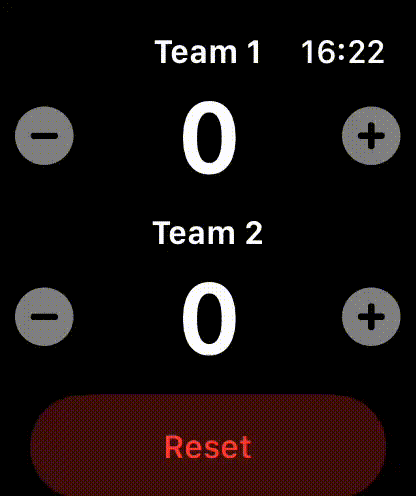

# Scoreboards Watch App



Scoreboards Watch App is a simple watchOS application that allows users to keep track of scores for two teams. The app provides an intuitive interface to increment and decrement scores and reset them when needed.

## Features

- Track scores for two teams
- Highlight the last team that scored
- Reset scores with a long press

## Requirements

- Xcode 12.0 or later
- watchOS 7.0 or later
- Swift 5.0 or later

## Installation

1. Clone the repository:
   ```sh
   git clone https://github.com/yourusername/scoreboards-watch-app.git
   ```
2. Open the project in Xcode:
   ```sh
   open Scoreboards.xcodeproj
   ```
3. Build and run the app on your watchOS simulator or device.

## Usage

1. Open the app on your Apple Watch.
2. Use the steppers to increment or decrement the scores for Team 1 and Team 2.
3. The last team that scored will be highlighted.
4. Long press the "Reset" button to reset both scores to 0.

## Project Structure

- `Scoreboards Watch App/`: Contains the main app source code and assets.
  - `Assets.xcassets/`: Contains the app's assets including the app icon and accent color.
  - `ScoreboardsApp.swift`: The main entry point of the app.
  - `ScoreboardsView.swift`: The main view of the app.
- `Scoreboards.xcodeproj/`: Xcode project files.

## Contributing

Contributions are welcome! Please open an issue or submit a pull request for any improvements or bug fixes.

## License

This project is licensed under the MIT License. See the [LICENSE](LICENSE) file for details.
