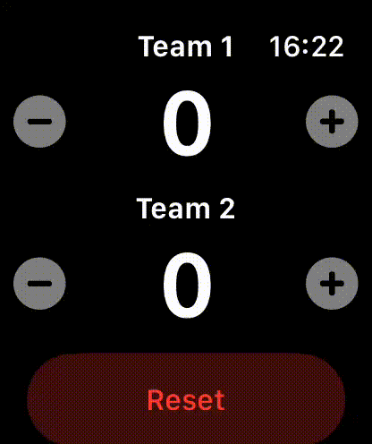

# Scoreboards Watch App



A watchOS app for tracking scores between two teams, with watch face complications that show live scores at a glance.

## Features

- Track scores for two teams with increment/decrement steppers
- Highlight the last team that scored (green tint)
- Scores floor at 0 — no negative values
- Reset scores with a 1.5s long press
- **Scores persist** across app restarts via shared App Group UserDefaults
- **Watch face complications** (circular + corner) showing live scores
- Complications update instantly when scores change

## Requirements

- Xcode 16.0 or later
- watchOS 11.2 or later
- Swift 5.0 or later
- Free Apple Developer account (no paid membership needed)

## Setup

```sh
git clone https://github.com/MicheledG/ScoreboardsWatchApp.git
open Scoreboards.xcodeproj
```

Select the **Scoreboards Watch App** scheme, choose a watch simulator or paired device, and run.

> **Note:** Live scores in the watch face complication require an App Group (paid Apple Developer account). With a free account, the complication works as an app launcher only.

## Usage

1. Open the app on your Apple Watch
2. Tap **+** / **−** on each stepper to change team scores
3. The last team that scored is highlighted in green
4. Long press **Reset** (1.5s) to clear both scores
5. Add the **Scoreboards** complication to your watch face to see scores at a glance — tap to open the app

## Project Structure

```
Scoreboards Watch App/
  ScoreboardsApp.swift      # App entry point
  ScoreboardsView.swift     # Main UI: TeamScoreView + reset
  ScoreStore.swift          # Observable state + UserDefaults persistence

Scoreboards Widget/
  ScoreboardsWidget.swift        # App launcher complication (circular + corner)
  ScoreboardsWidgetBundle.swift  # Widget bundle entry

Scoreboards Watch App Tests/
  ScoreStoreTests.swift    # Unit tests for ScoreStore logic
```

## Adding Unit Tests

The test file is included but needs a test target in Xcode:

1. **File > New > Target > watchOS > Unit Testing Bundle**
2. Name it `Scoreboards Watch App Tests`
3. Set the host application to `Scoreboards Watch App`
4. Add `Scoreboards Watch App Tests/` as a file system synchronized group
5. Run tests with `Cmd+U`

## License

MIT — see [LICENSE](LICENSE)
